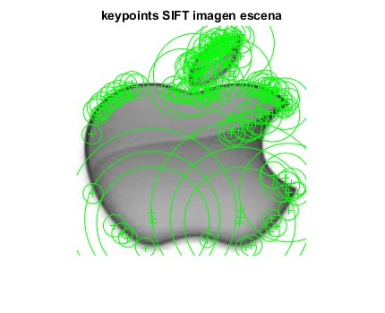
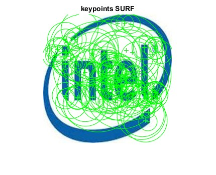

# Logo Recognition App
A MatLab app developed using CV techniques for logo recognition.

## Project Overview
The purpose of this app is to give a **Computer Vision** based solution to the logo recognition problem. Some of the descriptors used for developing the app are:

- Histogram Of Gradients (HOG) 
- Scale-Invariant Feature Transform (SIFT)
- Speeded-Up Robust Features (SURF)

For a broader understanding of the project, a glance at the [Documentation](docs/VC___Proyecto_Final.pdf) is advised.

## Usage

To use the Logo Recognition App, the following steps must be followed:

1. If you don't have MatLab in your machine, install it.
2. Based in the descriptors you want to use, the following files should be executed: [extractLogoSIFT.m](src/extractLogoSIFT.m), [extractLogoSURF.m](src/extractLogoSURF.m), [HOGextractor.m](src/HOGExtractor.m).
3. Modify [app.m](src/app.m) to recieve as input the image you want to test.
4. Run [app.m](src/app.m).

The Matlab console should now display the company name the input logo belongs to.

At this moment, the app only recognizes the 8 logos stated [here](data/logos/), but given the techniques used, should be easily expandable.